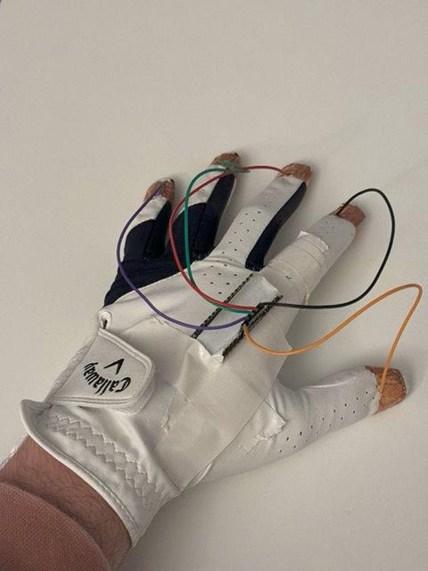

## Video Demo: [Google Drive](https://drive.google.com/file/d/1vNHQEFpQ-9MaybYsJ5he-neDewF23Xwy/view?usp=sharing)

## Code: [github.com/bhackel/pentaglove](https://github.com/bhackel/pentaglove)

This was a group project where we designed and built an Arduino-connected glove that would assist a user with drawing commands.

The glove holds an Arduino Nano 33 BLE on top, mounted simply with tape. The Arduino is powered over USB by a battery bank.

The accompanying desktop application is a simple Python script that reads the currently stored value in the Bluetooth characteristic. It uses an enumeration to represent the different glove states, with 6 different options: one for each finger connected to thumb totaling four options, one for index and middle connected, and one for pinky and ring connected.

Each of these finger positions maps to a different function for the computer. For instance, connecting the index finger and thumb will switch to pen mode, whereas the ring finger and thumb will switch to shape mode.

We managed to win the competition with this project. We were initially surprised by this as we felt the code was quite simple, but I believe that the success came from having a unique idea. 

The theme of this competition was productivity, and we managed to relate to a problem that people actually had when drawing. For instance, switching to an eraser on an iPad requires an unintuitive double tap gesture. This project solves that problem in a simple and elegant way.

In the future, I could see a similar gesture being recognized by a pair of AR glasses with cameras.
