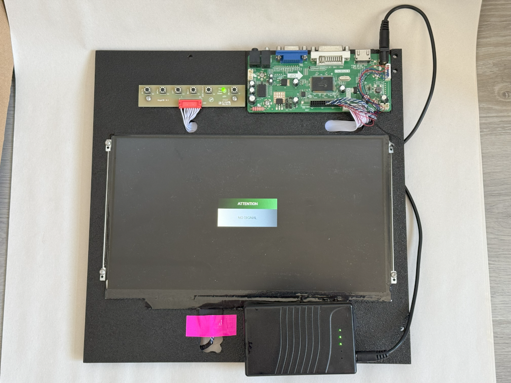
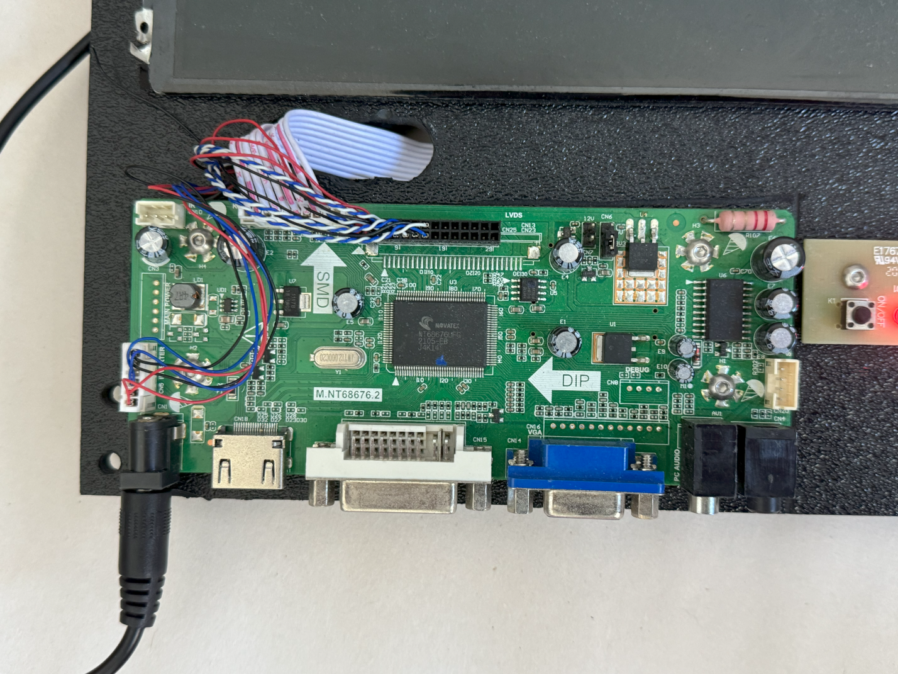
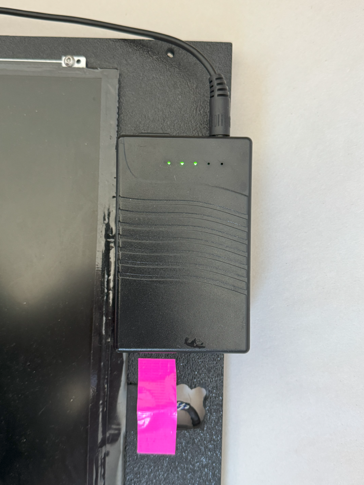
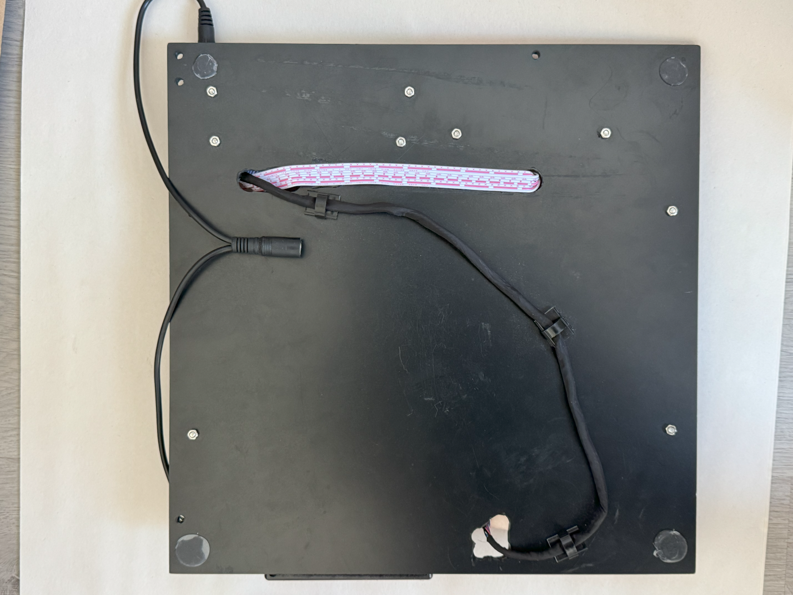

## Context

I enjoy messing around with building computers as a hobby. I have my own personal rig, which is a super small form factor build, along with a server computer which I use to host my high school friend group Minecraft server and Discord bot. Additionally, during the mining craze in 2021, I built a few mining machines using old graphics cards that I collected from friends.

## Problem

All of these computers meant that I would need some way to debug and control them without buying a monitor for each of them. Therefore, I had the idea to use an old laptop screen as a monitor that I could carry around. Turns out that this conversion is certainly possible.

## Build

I took apart an old laptop and removed the screen for use with this project. As it turns out, there are companies that make external display drivers for these laptop screens. I purchased one from Ebay, and after a few weeks, it arrived. I got an old square of plastic to mount everything on, and placed everything on there nicely. After that, I created some screw holes to bolt things together, and then plugged in all of the parts. To power it, I bought a 12V portable battery bank that I connected to the display driver, and mounted it as well.

Using the monitor is like any other portable display. I simply power it on, and plug a device in. The compact design, battery, and wide range of input types allowed me to use this display for many different applications.

