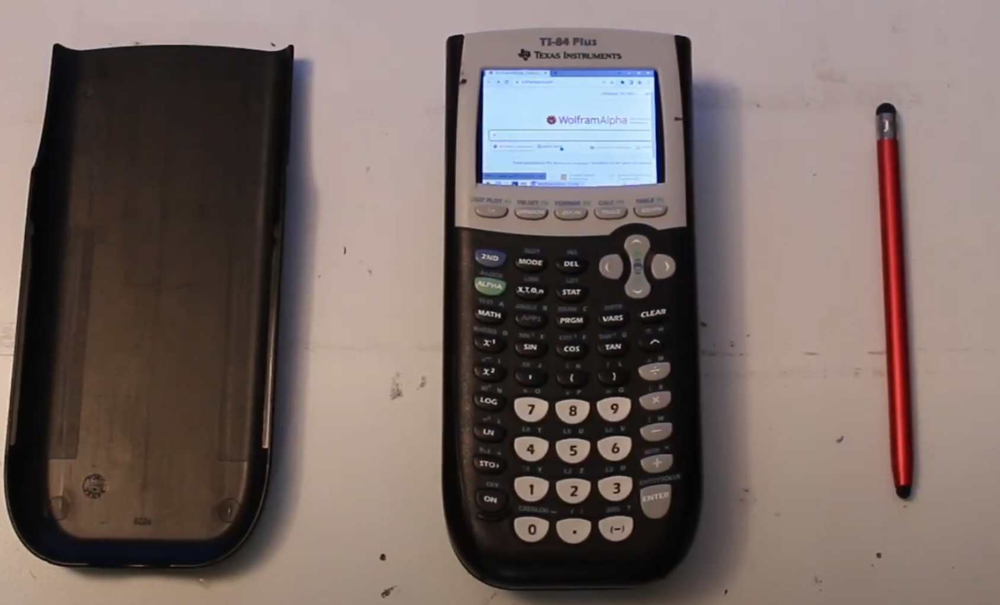

## Video Link: [youtu.be/vD6gb1G7HaI](https://youtu.be/vD6gb1G7HaI)

## General

I had an idea back in March 2022 to create the most powerful TI-84 Calculator possible. My goal was to somehow get Wolfram Alpha running on one in any way possible. The idea of running Wolfram Alpha on a calculator seemed weirdly funny to me, so I went ahead with the build process.

For this project, I decided to create a YouTube video to share my project, since I wanted to share the idea with others.

## The build

The actual build is quite straightforward: Take a broken TI-84, cut out its internals, and insert a mini touchscreen and a Raspberry Pi Zero 2 Wireless. Then, connect them using some compact cables, and strap a battery on the back.

You can watch the full video for more information about the project.