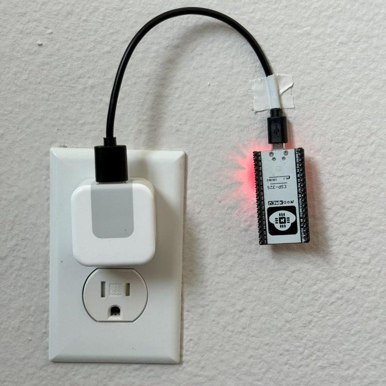

# Gym Tracker: Bluetooth Device Tracking and Analytics

## Repo: [github.com/Jackson-Wheeler/cse191-embedded](https://github.com/Jackson-Wheeler/cse191-embedded)

## General

This class project involved using ESP32 microcontrollers to track bluetooth devices moving around in our university's gym. The school's administration planned on renovating the space in the future and requested us to determine the popularity of certain locations to decide if they should be kept or updated. Therefore, our goal was to find what hotspots existed in the space.

We took around 25 ESP32 Microcontrollers and placed them throughout the school gym in various locations. Each ESP32 was constantly monitoring the MAC addresses of nearby Bluetooth devices and their associated RSSI values. Using this information, each ESP32 could determine how many devices are in a certain radius from the device.

## Initial Ideas and Testing

Our job as the Embedded team was to develop the code for the devices, determine reasonable locations in the complex for them, and deploy and maintain the devices. Since we were dealing with many devices in various locations, our goal was to only deploy them once. We did not have a smart way to update the code after it was deployed.

For this reason, we performed as much testing as we could before deploying the devices. This included testing them in a classroom, running multiple devices in the same room, and taking them to the gym for a mock deployment.

From these experiments, we uncovered a few different problems with our code over time. I've described the most significant ones below.

## Problems

### JSON Size Limit

One difficult problem to debug was the HTTP requests being over the supported size limit. Because we were scanning all nearby bluetooth devices, we would easily break through the 8192 byte limit of HTTP request headers. 

We tried to solve this by limiting the size of our JSON string to 8192, but we found after many hours of testing that even a size limit of 5000 bytes would sometimes break the HTTP connection. We settled on a limit of 4500 bytes, which worked reliably enough for this project, in addition to adding error-recovering code that could gracefully handle a failed connection.

### Wifi Dropout

Another problem that we encountered during the project was the ESP32 randomly stopping sending data to our SQL database. After investigating the issue, we determined that it was due to wifi connection issues.

To address this issue, we implemented several measures. Firstly, we conducted a thorough survey of the gym to identify areas with poor wifi coverage. Additionally, we optimized the code running on the ESP32 to handle wifi dropout situations more gracefully. We implemented error handling mechanisms to detect and recover from wifi connection failures. When a dropout occurred, the ESP32 would attempt to reconnect to the wifi network and resume data transmission once the connection was restored.

