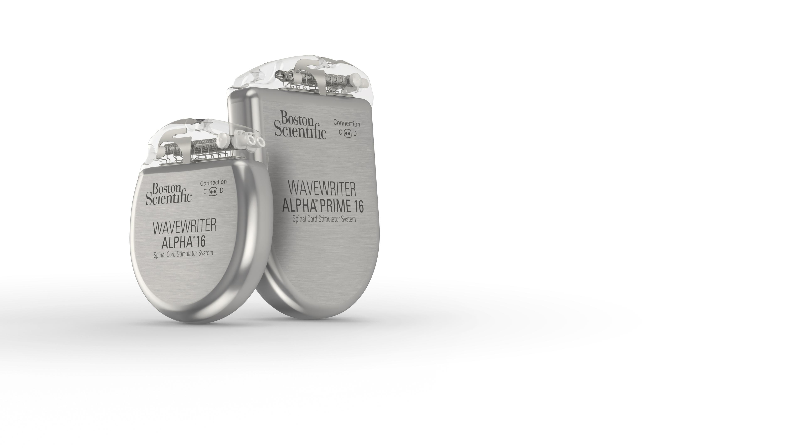

For the summer of 2024, I interned at Boston Scientific at the Neuromodulation division, and I wanted to share a little about my experience and talk about the therapy products that the company offers.

First off, most of the project that I worked on is under NDA unfortunately, but it essentially involved trying to predict patient sleep using movement data. Therefore, this post will focus more on the possibilities of the neuromodulation space.

The neuromodulation division of Boston Scientific currently offers a few different implantable devices for both spinal cord stimulation (SCS), and deep brain stimulation (DBS). SCS is used to treat long term chronic pain by delivering special electrical impulses to the spinal cord, which can block pain signals. DBS, on the other hand, sends impulses to specific areas in the brain to treat neurological disorders, like Parkinson’s disease.

The thing that fascinated me the most about this space is that it seems to be quite novel. Although these technologies have been around for over 20 years, the general idea is still to inject noise into brain signals to prevent pain from being received by the brain. I see great potential for future therapies when researchers figure out other ways to modify the brain to reduce pain experienced by patients.

Part of my work for the summer involved the concept of sensing. Sensing in this context means reading the current state of the body in some way, such as detecting sleep, and then modifying the stimulation as a result. For example, if you detect someone is sleeping, you could change the level of stimulation such that it would not disturb their sleep as much, providing better quality sleep. I see great potential for this development, because it would allow for more automated therapy, which would improve the experience and reduce the costs for the business.

I think that with the development of low-power neural processing chips, these implantable devices may be able to use machine learning to improve the therapy control using many different sensing points, all inputted into a model that can control the therapy level accordingly. This is definitely a few years out, but I see it as a great path forward for the future of implanted medical devices.

All images are from [https://news.bostonscientific.com/image-gallery](https://news.bostonscientific.com/image-gallery)