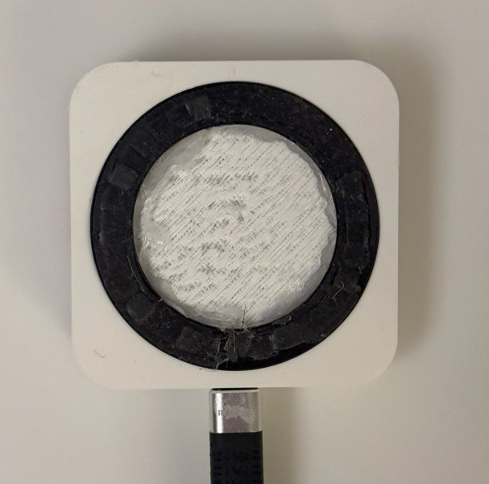

## Since Last Time

At the end of the last post, around 8 months ago, I mentioned the creation of an app. At that point, I had a working app, but it was not something that I felt I could call my own. This was because of the heavy reliance on other people's work. However, since then, I have had a lot of practice with UI development from my Modded YouTube project, so I plan to make the app something special.

Additionally, and more importantly, I've updated the form factor based on a new idea I had. The major issue with the previous form factor was the reliance on an external battery and cable. This made it extremely impractical for daily use, since the bulky battery and tether rendered the project annoying to use. Therefore, I came up with the idea to use a ring of magnets to attach with MagSafe on the back of the phone. Then, a very short USB-C cable can be used to power the device. Both of these were possible with my upgraded phone.

## The app

First, let's talk about the app. I originally followed [this guide](https://leonardocavagnis.medium.com/from-arduino-programming-to-ios-app-development-8b5da1783e1e) for building the app back in February, which involved some minor modifications from their existing work. 

However, I have an idea for a new design involving full-screen color shifting to indicate the hazard-ness of the current CO2 level detected. As mentioned before, I have gained a lot of skills and UI understanding from the Modded YouTube project, and therefore expect to have much more success this time around with creating my own app.

## New Hardware

One of the goals with this new design was to introduce a USB-C connector. The idea was simple: Get a female USB-C breakout board, and connect up the power connections so that it could power the Arduino. Then, I could simply connect my phone to the device using a C to C cable.

A question I had was how a C-to-C cable would decide who is supplying and receiving power. In normal A-to-C USB cables, there is always one side providing power, which is the A side. However, in a C-to-C cable, there must be some type of communication to determine who is providing power. Another resulting question is, how can devices communicate which one should receive power if they are dead? Therefore, there must be a passive communication about which is a supply versus sink. The most likely solution then is a pull-down resistor, and after looking at the spec, this is exactly the case.

These are the breakout boards that I purchased off Amazon. After some searching online, it turns out that it is possible, but difficult, to add the 5.1k pull-down resistors required. According to the spec, they must exist between pins CC1 to GND and CC2 to GND. Therefore, there must be 2 resistors.

As someone who has never done surface mount device (SMD) soldering before, this was quite the challenge. I looked up a few tutorials and eventually soldered on one of the two required resistors. You can see above how absolutely tiny the resistor is, compared to my finger in a gray glove.

You may notice the cut trace in the above picture. The purpose of this has to do with the design of the PCB. After digging around for this breakout board, some clever people determined that both CC pins are connected together. In order to follow the spec, they must be disconnected and have individual 5.1k resistors connected to ground. Therefore, this trace must be cut.

The next resistor proved much more challenging. This one must go between two connecting pins for the USB-C, rather than on top of contact pads. After a few days of trying, I successfully got this resistor attached.

After some CAD work to design a new case and a magnetic ring, I had the new shell for this design.

This all results in the final design, which magnetically attaches to the back of the phone

This new design vastly improves over the previous one in functionality, comfort, and usability. This successful iteration allowed for a much improved product by incorporating the MagSafe ring and USB-C compatibility.

After all of this however, when I went to test the device, I discovered that during my soldering, I either managed to solve all of climate change, or kill my CO2 sensor.

The normal baseline for CO2 in the environment is 400ppm, and since my sensor was reading out way less than that (sometimes down to 90ppm), something was clearly broken here. But, that concludes this iteration of the CO2 sensor project. Next I plan to develop my custom app and maybe design a custom PCB for this prototype.