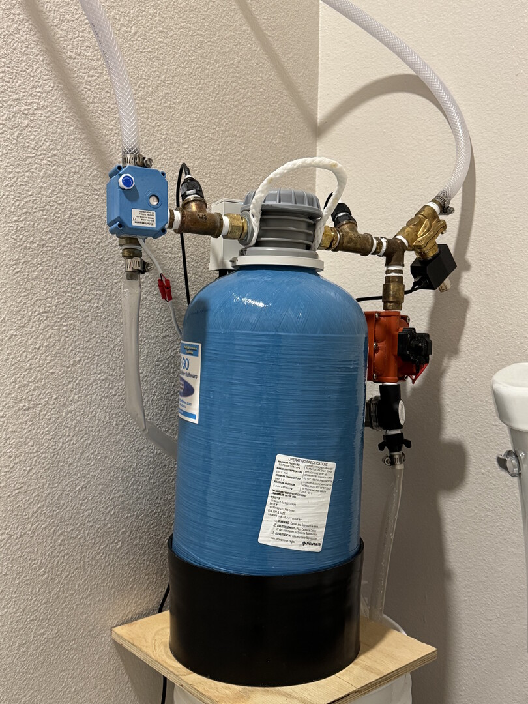
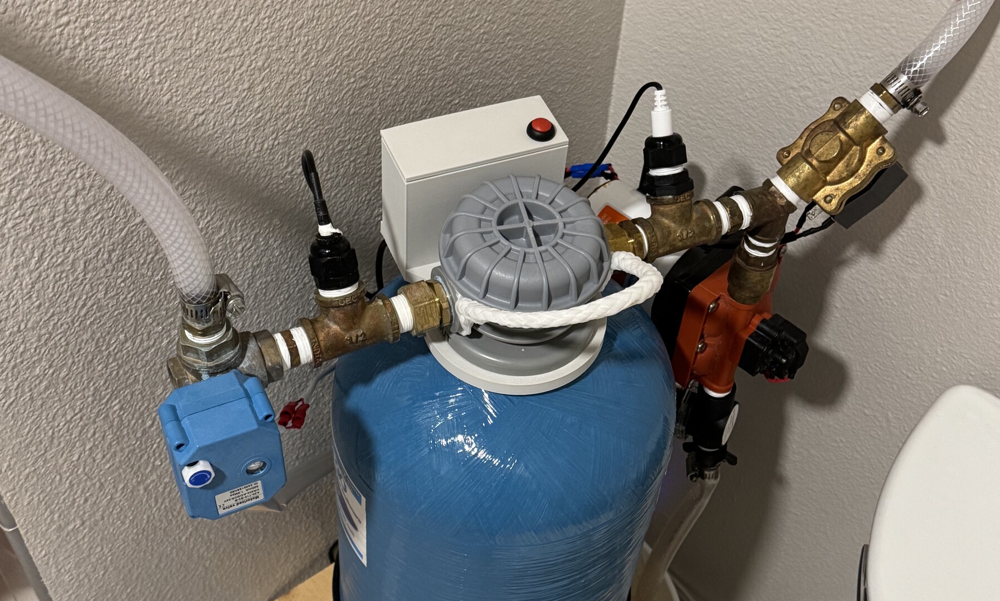
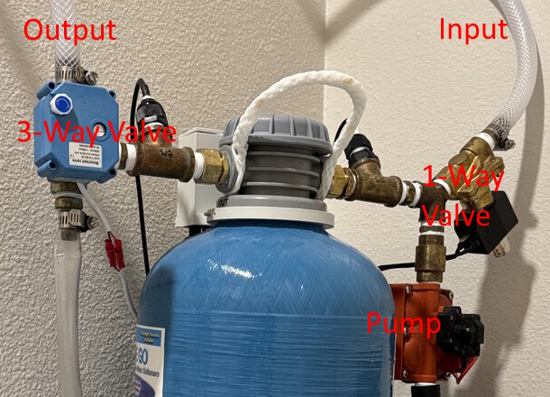

**GitHub Repo: [Water Softener Automation](https://github.com/bhackel/water-softener-automation)**

## Summary

Low-Cost Automated Portable Water Softener project using valves, relays, a pump, and an Arduino for control, all placed on a custom PCB in a 3D printed case with 12V powering everything. Challenges faced include compacting the design to fit in a 1ft x 1ft footprint to avoid blocking toilet users, preventing leaks throughout, and integration.

## Introduction

Back in December 2023, I bought an *On The Go* Portable Water Softener for my shower, as San Diego water is quite hard compared to where I grew up. I purchased the Double Standard 16,000 grain unit for ~$200 and connected it to the shower plumbing. The unit worked great, but because of the small size, it **requires manual regeneration every ~2 weeks**, a process which takes about an hour. Then, when I took an embedded project, I had the idea to automate it as my project.

## Iterations

### Prototype 0

### Prototype 1

### Final Version

### Custom PCB

## Functionality

The water softener regeneration process can be broken down into 3 main steps. The first is filling the brine bucket. This provides water, which is immediately mixed with salt (two 26oz salt containers)

Once the brink tank is full, the cycling step begins. This involves circulating the salt water around in a loop using a pump. This process replaces the hard calcium and magnesium ions with sodium ions.

The final step is flushing out the remaining calcium, magnesium, and sodium ions in the water, in addition to draining the bucket.

### Sensors

The project incorporates a TDS (Total Dissolved Solids) sensor and a temperature sensor for monitoring the water hardness. When a threshold is reached, the on-board LED indicates to the user that a regeneration is required.

To determine bucket fill level, an ultrasonic sensor is placed on the bucket edge.

### Valves/Solenoids/Pumps

To control water flow, three separate items are used. The first is a Normally-Open One-Way valve. This blocks the shower water from entering the system when regenerating. The second is a 3-way ball valve, which switches the water softener output from Shower Head mode to Circulation mode. The final item is a pump for circulating the salty water through the water softener.

## Issues Faced

**Board and sensors malfunctioning simultaneously:** For a multitude of reasons, the Nano 33 BLE that I used in the 2nd phase of this project was replaced by a Nano ESP32. Some issues encountered include faulty Ultrasonic sensor readings, Bluetooth not starting, and the OneWire-based temperature sensor not being recognized by the device.

**Nano ESP32, PlatformIO, and OneWire:** Because the Nano ESP32 is based on the ESP32 platform, which is unique for the Arduino Nano platform, it has strange issues with GPIO arrangement. The commonly used OneWire library does not respect the Digital pin ordering used by Arduino and instead changes registers directly, causing strange issues. 

For example, I would flash a small OneWire test program onto the Nano, and it would work flawlessly. I could then upload my own Water Softener program onto the Nano and still successfully read temperature values. However, if I were to then hardware reset the device, the OneWire would stop working.

I fixed this by digging through the source code and adding a PlatformIO flag in platformio.ini: `build_flags = -DBOARD_USES_HW_GPIO_NUMBERS`

**BLE Polling:** On the firmware side, the lack of a RTOS means that BLE must be refreshed using the `BLE.poll()` method every ~20ms. This meant restructuring parts of the code to be non-blocking using state machines.

## Next Ambitions

Future goals include redirecting waste water to a toilet reservoir, improving salt dissolving in the brine tank, and automating salt addition.

Other features I would prefer would be using USB-C PD to get 12V power instead of the massive external power supply that the current design uses. 

