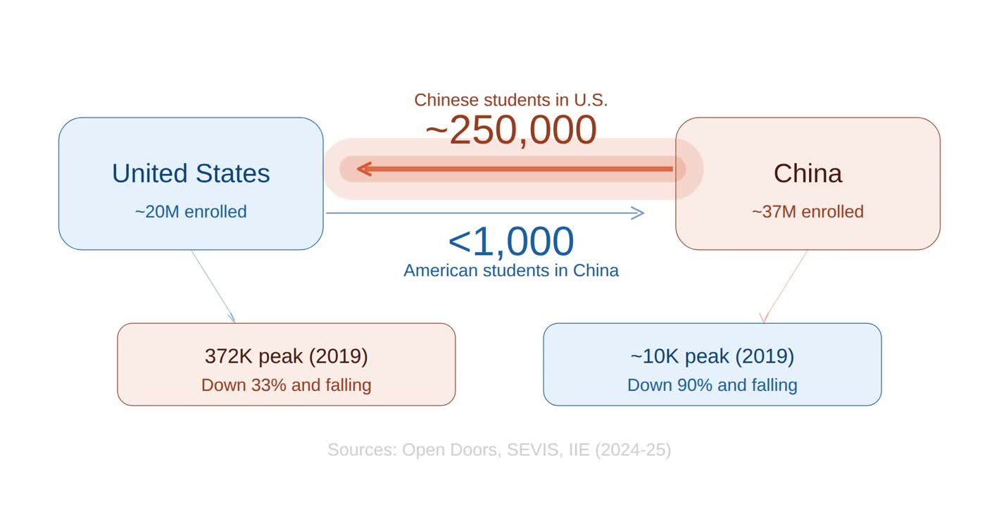

*This piece is vibe-researched and extremely biased*

## The Numbers

Opus 4.6: "Americans studying in China have collapsed. Before the pandemic, roughly **10,000** American students were studying in China. That number has dropped to **fewer than 1,000 today**. A Christian Science Monitor report from 2024 put the figure at around 700. Open Doors data tracking U.S. students in China from 2012/13 through 2022/23 shows numbers fell dramatically starting in 2019/20 due to the pandemic and related travel restrictions, and have not recovered since."

"For context, the flow in the opposite direction is far larger but also declining. Chinese student enrollment at American universities dropped to **277,000** in 2023-24, down from a peak of **372,000** in 2019-20. For the 2025-26 year, new international arrivals to the U.S. **dropped 19%** compared to 2024, with Chinese enrollment being the biggest source of decline."

Claude explains that US universities/students are orienting towards Taiwan as an alternative. Claude further explains that censorship and restrictions have increased in recent years and scared away universities from risking study-abroad programs.

## US Education is Slipping

I am wondering if more American students will want to study in China in the future. Post-COVID and AI have degraded the quality of American college education. These Master's programs seem even more like incredible money-grabs after this presidency cut education funding. Tuition keeps increasing and acceptance rates continue dropping.

## China Education is Rising

Meanwhile in China, top schools are climbing ranks.

"THE (Times Higher Education) 2026 rankings. Tsinghua University sits at **12th globally** and Peking University at **13th**, **up from 42nd and 47th respectively just ten years ago**. 18 Chinese universities achieved their best-ever positions this cycle. Zhejiang University jumped eight places to 39th and Shanghai Jiao Tong moved up 12 spots to 40th, both entering the top 40 for the first time and overtaking Georgia Tech, McGill, and UBC in the process."

You can see this in recent robotics research. Definitely vibes but I see a bunch out of Shanghai Jiao Tong, Tsinghua, and Peking University.

## The Disconnect

Then I argue the reason that American students are not studying abroad in China is due to policy restrictions and a lack of a US-to-China pipeline. **The value of US to China International Studies is present and growing.** Especially if any future administrations want to bring back manufacturing, then the knowledge gained by STEM students in these programs will be extremely valuable.

## The Opportunity

Is there a potential business opportunity here? Maybe. International High Schools are rare in the US. "The fundamental asymmetry is that China's international schools exist to funnel students out toward foreign universities, while U.S. international schools mostly exist to serve expat communities." There's probably more opportunity for an **individual advisor** that helps students prepare for tests, write essays, etc. like what exists from China to the US.
