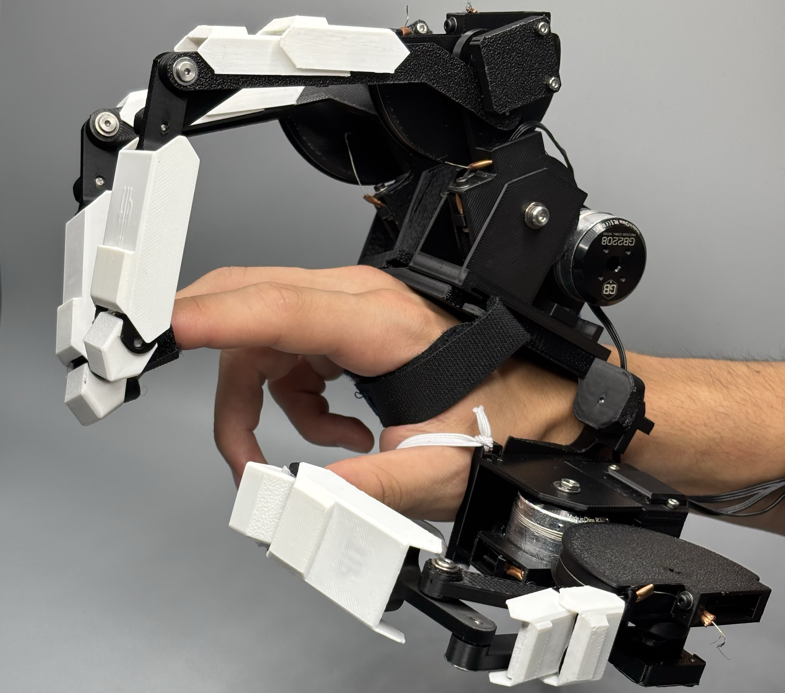

<video controls width="100%">
    <source src="media/N2D Demo Video_subtitled_480p.mp4" type="video/mp4">
    Your browser does not support the video tag.
</video>

## Paper

### [Haptic Glove Paper](Haptic_Glove_Paper.pdf)

## Summary

The N2D Glove aims to solve the issue of effectively teleoperating a multi-DoF robotic hand.

Current teleoperation systems use IMUs for tracking finger position, and provide force information using haptic motors or vibration pads. **Current offerings at most provide active force feedback in one-dimension**.

The N2D Glove provides **active force-feedback in two dimensions** for multiple fingers, allowing for complex teleoperation feedback like pushing buttons or inserting pegs into holes.

## My Contributions

On the technical side, I **fixed many bugs in the force-calibration** procedure, which allows us to command a force with a direction and magnitude, and have that correctly delivered to the fingertip. This is a crucial part of making the novel 2D feature effective.

I worked on **ROS2 integration with the Inspire Robotics hand** to go from force-sensing on the robotic hand to force-delivering on the N2D Glove.

For the paper, I researched in-depth about the **competing products and related works** and found a perfect niche that this project solves.

## Background

I joined this project because I wanted to make a low-cost force-feedback control project using the AmazingHand and the LucidVR Glove. This would be a 1D version.

<video controls width="100%">
    <source src="media/lucidv5%20complete.mp4" type="video/mp4">
    Your browser does not support the video tag.
</video>

I saw the project at the Contextual Robotics Institute Demo Day and reached out to join. I am greatful to be a part of this project and I think there is lots of potential left to explore.

