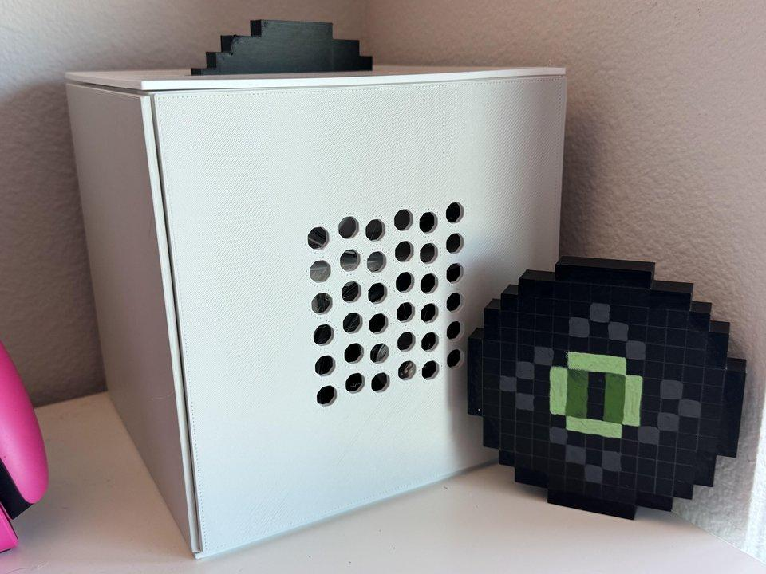
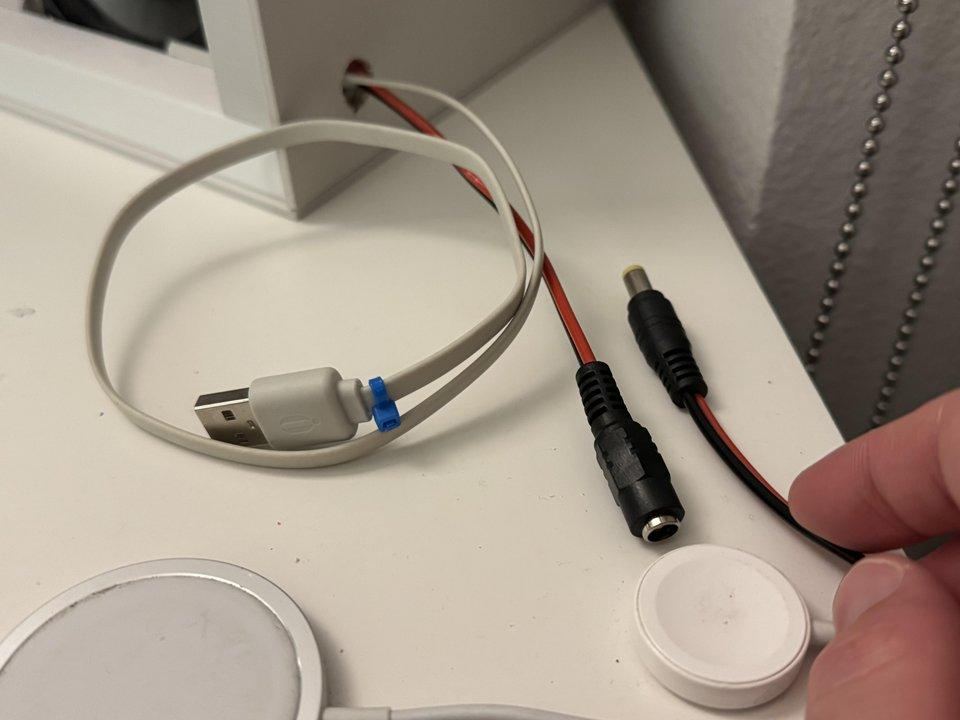

A work-in-progress project for a Minecraft Jukebox. Uses a Raspberry Pi and Pi Camera to identify the disc that is inserted. Two speakers play audio using a bluetooth amplifier board.

<video controls width="100%">
    <source src="media/demo.mp4" type="video/mp4">
    Your browser does not support the video tag.
</video>

All parts are 3D printed. Discs are painted using acrylic markers.

Two LEDs light up the 5x5 center of the discs, which is unique and interpreted to play a specific track.

All walls can be removed and are held in place with plastic clips.

The Pi is mounted onto the top piece, which rests on top of the frame and can be lifted up for easy maintenance.

Power is provided using a 5V USB for the Pi and a 19V repurposed Chromebook charger for the amplifier.

## Things left to do

The primary task left is to paint the walls to match the Jukebox color.

The code needs to be updated to support multiple discs.

More discs need to be made. This requires imagining what the texture of the discs should be, since the ones in-game are not circular. Therefore I need to convert the oval shape into a circle.

Speakers could be replaced with ones that have better bass and treble.

## Slow Progress

Progress has been slow because this project does not teach me anything new with the current design, so I have been avoiding it. I am also not sure how to paint the walls to look nice.