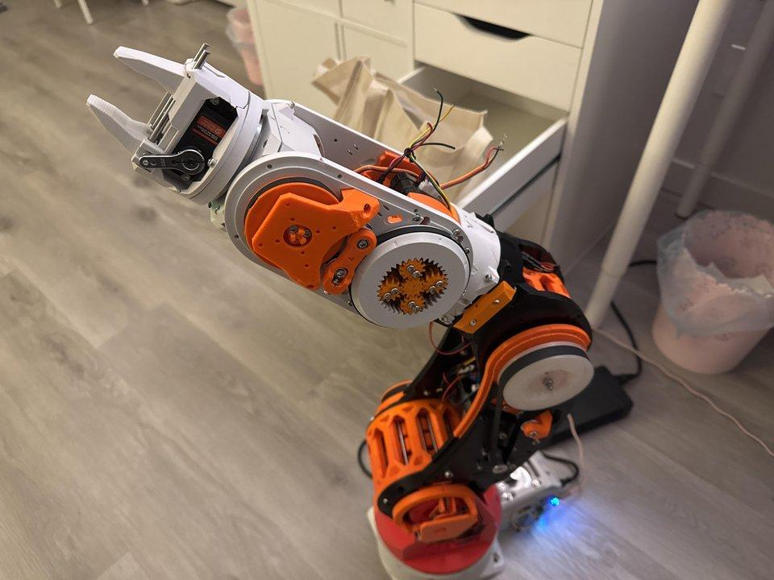
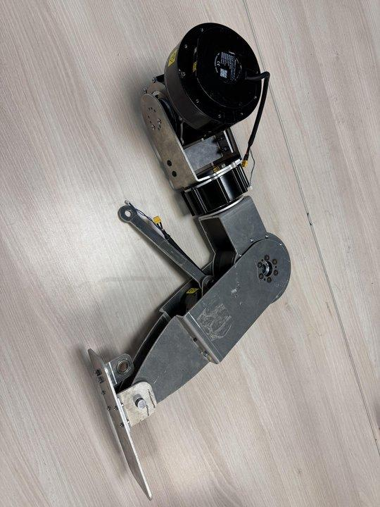

<video controls width="100%">
    <source src="media/pseudo%20walking.mp4" type="video/mp4">
    Your browser does not support the video tag.
</video>

This page documents the progress that Triton Droids has made since I started as Electrical Lead in Summer 2025.

First I finished the 2nd half of the mechanical assembly of the ARCTOS 6-DOF arm. I have a full page dedicated to this here: [dedicated ARCTOS page](/posts/1763354016452-arctos-arm/)

We started the school year with one leg assembled. I led the wiring for that, which was straightforward except for weird connectors.

The smaller RobStrides use a XT30 (2+2) connector which did not exist on Amazon when we started. Both this and the small CAN connector were purchased from AliExpress.

We struggled for a while to get CAN communication to work with the motors. It was a complex mix of hardware issues (dead CAN adapters, CAN adapters with special protocols) and software issues (unknown CAN buffer bugs on Linux, unclear documentation).

I got the first successful motor movement, and we eventually made a Python wrapper for common CAN commands to simplify things.

<video controls width="100%">
    <source src="media/robstride%20first%20movement.mp4" type="video/mp4">
    Your browser does not support the video tag.
</video>

Mechanical team worked fast and we quickly got a lower-body finished.

After struggling to remap motor IDs for a while due to wiring issues, motor-reply issues, and no documentation of default motor IDs, we eventually got open-loop lower-body control.

<video controls width="100%">
    <source src="media/first%20kicking.mp4" type="video/mp4">
    Your browser does not support the video tag.
</video>

<video controls width="100%">
    <source src="media/first%20suspended%20movement.mp4" type="video/mp4">
    Your browser does not support the video tag.
</video>

For a long time we had an issue with encoder values. On power-reset, some motors would have their position change by 16384 units, which would be multiple rotations off. This resulted in multiple crashes. I had the foresight for an issue like this so we have an E-Stop switch for this.

I was able to fix this bug using a certain offset flag in the motor's firmware. The image below shows motors with vastly different encoder values (7F FF versus BF FF).

We have been stuck trying to deploy our locomotion policy onto the legs. This has involved adding an IMU, performing PID tuning on the motors, and making a system that integrates that all together with safety checks.

For other projects, recently we finished assembly of the AlohaMini. I fixed a motor ID assignment issue and vibed up a basic open-loop control app.

<video controls width="100%">
    <source src="media/driving%20alohamini.mp4" type="video/mp4">
    Your browser does not support the video tag.
</video>

Other members have worked on multiple SO-101 arms to do imitation learning projects.

<video controls width="100%">
    <source src="media/coffee.mp4" type="video/mp4">
    Your browser does not support the video tag.
</video>
