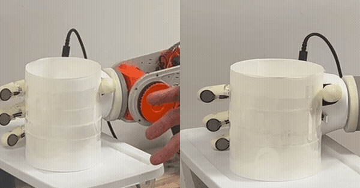
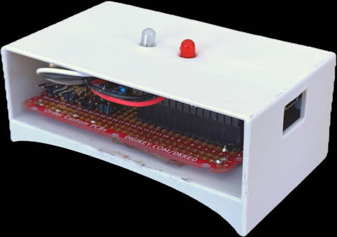
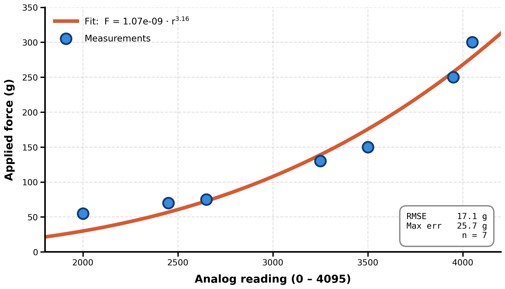
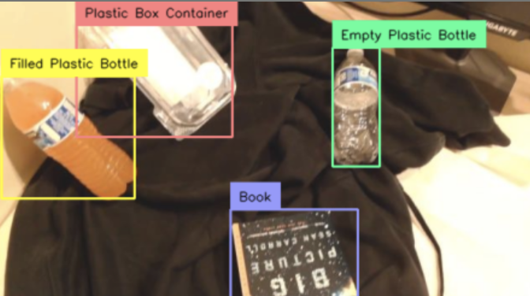

## Summary

For CSE 237D at UCSD, I led a group of 5 students in building a sub-$200 robotic hand with fingertip force-sensing resistors, allowing the hand to grasp without crushing. We then stretched and added vision, VR teleop, and simulation, then mounted it on a teleoperated 6-DoF robotic arm.

GitHub: [cse-145-237d-tactile-hands](https://github.com/triton-droids/cse-145-237d-tactile-hands)

## Hardware

The hand is the [AmazingHand](https://github.com/pollen-robotics/AmazingHand) from Pollen Robotics. It has 4 fingers and 8 [Feetech SCS0009](https://www.feetechrc.com/) servos, two per finger.

We put four [Pololu FSR #2728](https://www.pololu.com/product/2728) sensors on the fingertips. Each one sits in a 48kΩ voltage divider read by the ESP32-S3's 12-bit ADC. The firmware samples all four channels at 100 Hz, converts the raw counts to force with the per-sensor calibration below, and streams a timestamped CSV line over USB at 115200 baud. The board is a protoboard with vertical headers for the FSR leads, and some status LEDs, all in a 3D-printed enclosure on the back of the hand. Power comes from a 2S LiPo (7.4 V) stepped down to 5 V by a buck converter.

On the host, a ROS 2 node parses the serial stream and publishes calibrated forces on `/tactile/forces`, and forwards target servo positions back on `/servo/commands`. The webcam, VR, and sim inputs all output to that same servo interface, so we could build them in parallel and swap them in and out.

## Calibration

FSRs are nonlinear and quite noisy, so getting good data out of them was challenging. Shree built a 3D printed plate that alloweed stacking reference weights, then logged raw ADC at seven points. A power-law fit `F = 1.07e-9·r^3.16` came out to 17.1 g RMSE and 25.7 g max error.

## Force-aware grasping

With force calibrated, the control loop follows the commanded finger close amount while monitoring that finger's live force. The moment the force crosses a safe threshold, it stops allowing further finger closing, and the red status LED turns on.

## Reach goals

After the MVP was done at week six, each of us took one reach goal and worked on it in parallel, then integrated at the end.

### Vision

Thomas built a webcam pipeline with MediaPipe Hands and OpenCV. It reads per-finger curl from the tracked joints and maps it to servo commands, so the hand copies your hand.

### Simulation

Ali ran the AmazingHand in MuJoCo and trained an in-hand cube-rotation policy. We ran out of time to transfer to the real hardware unfortunately.

### VR teleop

Sidath worked on the Quest 2 teleoperation portion of the project. We wanted to use the Quest 2, but we had difficulty using existing ROS2 bridge APKs from existing users. Ultimately I switched to Valve Index controllers, which were significantly easier to use in Python with OpenVR. Fortunately the controllers still have per-finger curl using capacitive touch sensors. In ROS2, the controller provides both the 6-DoF pose and a per-finger curl signal on `/servo/commands`, so the user's fingers control the hand while the pose moves the arm.

We started by using the controller in simulation to avoid destroying hardware.

<video autoplay loop muted playsinline width="100%">
    <source src="media/08.mp4" type="video/mp4">
</video>

### ARCTOS arm

Then we mounted the hand on a 3D-printed [ARCTOS](/posts/1763354016452-arctos-arm/) 6-DOF arm.

<video controls width="100%">
    <source src="media/09.mp4" type="video/mp4">
</video>

### Force-aware grasping, in the loop

For our final demo we showed that force aware grasping clearly prevents a thin-walled cup from being crushed.

### Vision-guided grip selection

Ali also fine-tuned a YOLO26 detector on a small custom-annotated dataset (filled vs. empty plastic bottle, a box, a book) so the hand could pick a grip force per object.

 A filled bottle needs a firmer hold than an empty one that looks identical. The detected class maps an object to a force threshold.

## Future Work

The fingers support limited adduction/abduction, but we found that pose estimation for those dimensions was noisy so we disabled it. Additionally the Valve index controllers do not support adduction/abduction.

The force loop is reactive only, so we found that closing the grip quickly would overshoot the threshold. Predicting force a step ahead would fix it, but would have its own issues.

Per-finger calibration data, and performing off-axis characterization of the force sensors. Then, using this data and plugging it into the simulator to improve sim-to-real performance.

The arm IK and smoothing still need work before it can do reliable autonomous pick-and-place.

The AmazingHand also doesn't have much reach or grip range, so it does better on bigger objects like a cup than on small ones.
