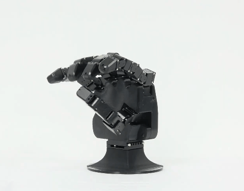
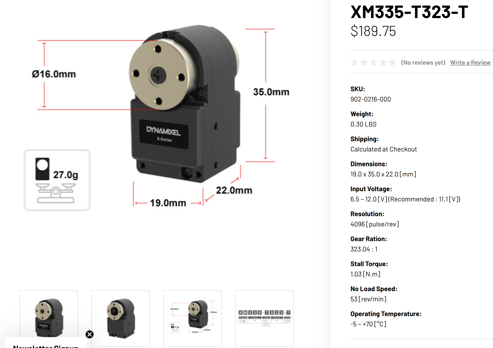
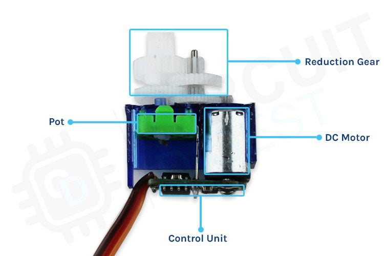
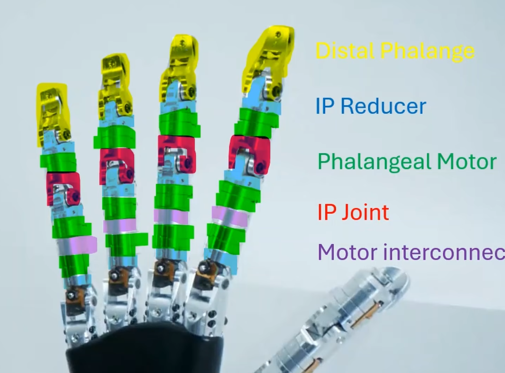
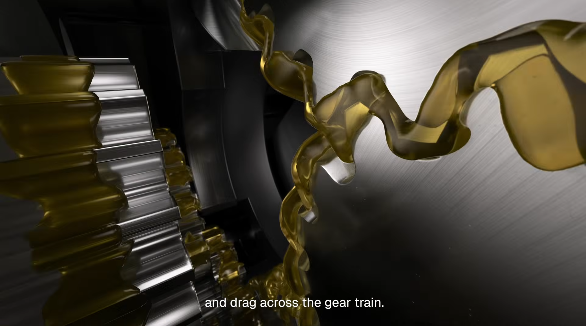
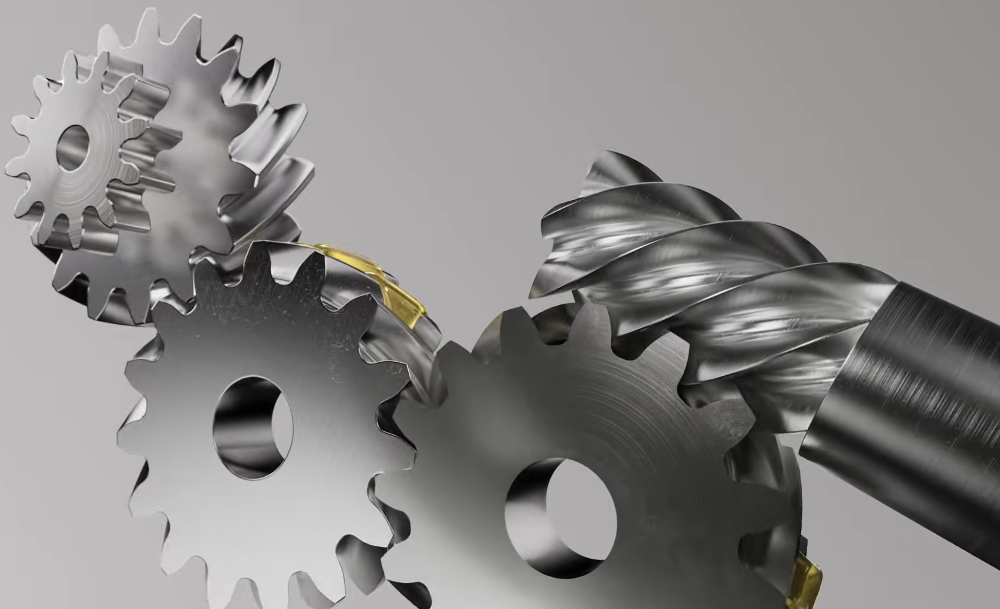
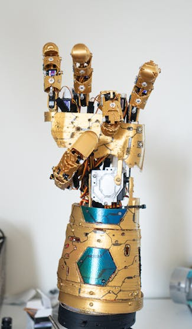

Robot hands have fallen into two main camps. One is tendon based, like Shadow Hand and Optimus's hand. The other is micro-servo based, which I see more short-term potential in.

The issue is these hands are **extremely expensive** for some reason. The Wuji hand is $16,000.

If one wants to DIY one, you need compact servos. Therefore you look to Dynamixel, who is leading the industry. These new **XM335** servos compose the Robotis hand and are **$190** each.

I see that price and think, theres no way!? Then I am reminded of the humble 9g micro servo, which sells for below $1 each. I think there's a great opportunity for a low-cost hobbyist hand using this.

However, the 9g servo is not the correct shape

I noticed a large open-air gap in the motor. If we can reorient the DC motor 90 degrees, we can gain that space back, and get the correct servo profile.

### Some unsorted pictures





[ROBOTIS Hand Series](https://www.robotis.us/robotis-hand/)

[DYNAMIXEL XM335-T323-T](https://robotis.us/xm335-t323-t/)

[This DIY Robotic Hand Can Sign the Entire ASL Alphabet Ambidextrously](https://www.hackster.io/news/this-diy-robotic-hand-can-sign-the-entire-asl-alphabet-ambidextrously-39eb87103383)
