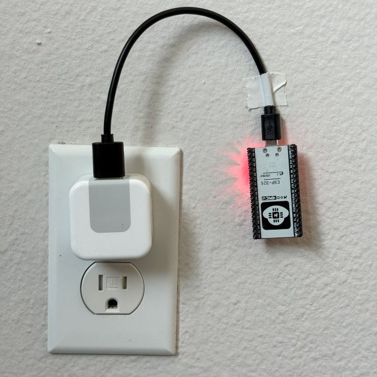

# [bhackel Projects](https://bhackel.github.io/portfolio/)

This repo contains documentation/links to all relevant projects that I have worked on.

The purpose of this repo is to make it easier for employers to view my work.

## [Automated Homework Grading System](dsc20-style-checker.md)
I tutor for an introductory Python programming class. This project reduced the grading time of homework by around 90% by eliminating the need for tutors to manually grade coding style. See details [here](dsc20-style-checker.md)

## [portable-co2-monitor](https://github.com/bhackel/portable-co2-monitor)
This is a project with the goal of making a very compact and discreet battery-powered Bluetooth CO2 monitor. You can view the documentation for it [here](https://github.com/bhackel/portable-co2-monitor)

## [Gym Tracker Project](cse191.md)

This class project involved placing around 25 ESP32 microcontrollers in various places at the school gym to determine which locations were most active. We used Bluetooth Low Energy MAC addresses and RSSI values to determine distance from the device. See details [here](cse191.md)

## [Bluetooth Drawing Glove](pentaglove.md) 
This project is a Bluetooth-connected glove that makes taking notes easier by assigning drawing shortcuts to hand gestures.
See details [here](pentaglove.md)

## [Recipe Generator (Agile Development)](recipe-generator.md)
This class project was a simulation of working with other people on coding a Recipe Generator app. We followed Agile software development principles with stand-up meetings, code review, pair programming, and other concepts. See details [here](recipe-generator.md)

## [Cheggbog](cheggbog.md)
Cheggbog is a fully automated discord bot for scraping Chegg links.
See details [here](cheggbog.md)

